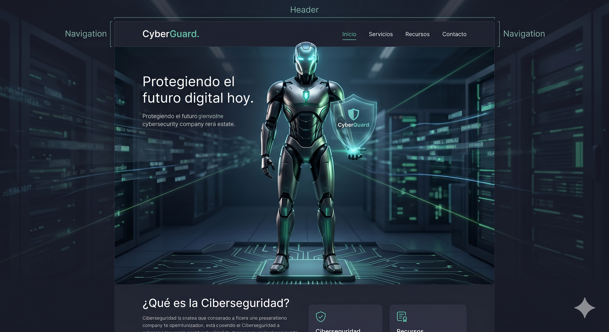

# 🛡️ CyberGuard Tech Solutions
### Plataforma de Ciberseguridad Avanzada

Bienvenido al repositorio de **CyberGuard**, una página web corporativa diseñada con estándares modernos de **HTML5** y **CSS3**. El sitio está enfocado en ofrecer soluciones de protección digital, auditorías y seguridad en la nube.

---

## 🤖 El Guardián del Sistema
Para representar nuestra fortaleza, el sitio cuenta con un guardián robótico en el encabezado (Hero Section).

*Nota: Si estás visualizando esto en GitHub o un lector de MD, asegúrate de que la imagen 'robot.png' esté en la misma carpeta.*

---

## 🚀 Características del Proyecto
- **Estructura Semántica:** Uso riguroso de etiquetas `header`, `nav`, `main`, `section`, `article` y `footer`.
- **Diseño Responsivo:** Adaptado para dispositivos móviles y escritorio mediante **Flexbox** y **CSS Grid**.
- **Estética Cyberpunk:** Paleta de colores oscuros con acentos en verde neón (`#00ff41`).
- **Formulario de Contacto:** Estructura funcional preparada para integración con servicios de backend.
- **Efectos Visuales:** Glassmorphism (efecto cristal) en el menú de navegación y sombras neón en los textos.

---

## 🛠️ Tecnologías Utilizadas
* **HTML5:** Marcado de contenido.
* **CSS3 Externo:** Estilos, animaciones y transiciones.
* **Google Fonts:** Tipografías modernas para legibilidad técnica.

---

## 📁 Estructura de Archivos
- `index.html`: Estructura principal del sitio.
- `styles.css`: Hoja de estilos con el diseño visual.
- `robot.png`: Imagen principal de identidad visual.
- `README.md`: Descripción y documentación del proyecto.

---

## 📝 Instalación y Uso
1. Descarga o clona este repositorio.
2. Asegúrate de que los archivos `index.html`, `styles.css` y `robot.png` estén en la **misma carpeta**.
3. Abre el archivo `index.html` en cualquier navegador moderno (Chrome, Edge, Firefox).

---
> **"Protegiendo el futuro digital hoy."** > *Proyecto desarrollado como práctica de diseño web profesional.*
